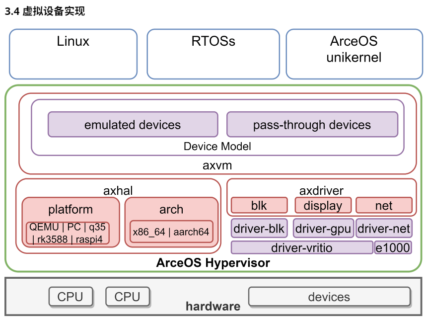
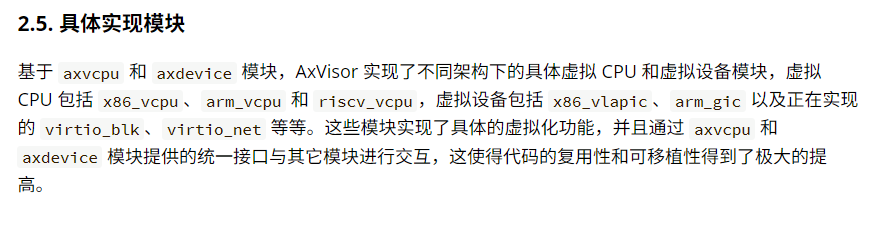
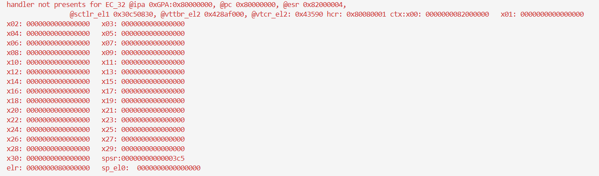
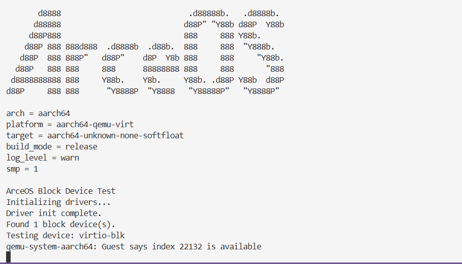

# 虚拟块设备开发文档
## Day 1
选题，让agent分析一下项目架构。

之前只接触过传统内核，unikernel，libos。头一次做Hypervisor的项目，难度还很大的，自己只是一介本科生，工程能力没那么强，但还是要挑战一下自己。

### 第一类和第二类Hypervisor:
```
第 1 类虚拟机监控器：

第 1 类虚拟机监控器或裸机虚拟机监控器直接与底层计算机硬件交互。裸机虚拟机监控器直接安装在主机的物理硬件上，而不是通过操作系统安装。某些情况下，在计算机的固件中嵌入第 1 类虚拟机监控器。

第 1 类虚拟机监控器直接与服务器硬件协商，为虚拟机分配专用资源。此类虚拟机监控器还可以根据各种虚拟机请求灵活共享资源。

第 2 类虚拟机监控器：

第 2 类虚拟机监控器或托管虚拟机管理监控器通过主机的操作系统与底层主机硬件进行交互。第 2 类虚拟机监控器安装在计算机上，在其中作为应用程序运行。

第 2 类虚拟机监控器与操作系统协商以获取底层系统资源。但是，主机操作系统优先为自己的功能和应用程序分配资源，而不是为虚拟工作负载分配资源。

```
**Axvisor属于第一类**

根据项目说明书：

在 Axvisor 的整体架构中，ArceOS 处于最底层，负责提供内存管理、任务调度、设备驱动、同步原语等多种基础功能；这些功能会被 Axvisor 的各个组件所使用。然而，从软件工程的角度上，我们不能让 Axvisor 的各个组件直接依赖于 ArceOS （的 axstd 等接口组件）；这一方面是因为我们希望 ArceOS 与 Axvisor 之间的耦合度尽可能的低，这样可以提高系统的可移植性、可扩展性和可维护性，另一方面则是因为，将对 ArceOS 的依赖分散在各个组件中，会使得依赖和 feature 管理变得极度混乱，容易出现各种错误。 

其底层 OS（ArceOS）是为 hypervisor/unikernel 场景设计的极简内核，不属于第二类 Hypervisor 所依赖的“宿主 OS”。




## Day 2 
看了下项目说明文档（https://arceos-hypervisor.github.io/doc/development/docs/docs.html）和virtio-blk文档（https://rcore-os.cn/rCore-Tutorial-Book-v3/chapter9/2device-driver-3.html）
了解Axvisor设计逻辑，学习虚拟化块设备以及驱动的架构

axdevice_base 是设备抽象的基础库,做了一系列定义。axdevice 中实现新设备需要符合 axdevice_base 设定的接口规范

## Day 3

根据：

并自己fork了对应子仓库查看项目结构，确定virt-blk应该就是在axdevice 内实现。不过axdevice里当前实现的虚拟设备功能很少，网络模块也没有实现，支持平台也只实现了aarch64 。

## Day 4

接着看项目架构，虽然大体知道了要在axdevice中实现这个块设备，但是很多接口对接细节还不清晰（感觉像在一堆齿轮中找到那个空隙嵌入新齿轮，并且还要保证和其他齿轮准确咬合）
于是我借助现代科技的力量，问了一些问题：

### 1. Axvisor中实现的虚拟设备模块如何在axvm注册实例，并最终集成到Axdevice的，具体到代码层面

Axvisor 将 configs/vms/*.toml 中的设备描述转换为 AxVMCrateConfig，再转成 AxVMConfig 并创建 VM。

AxVMConfig 把 EmulatedDeviceConfig 与直通设备等配置传递给 AxVM::new。

AxVM::new 用这些配置实例化 AxVmDevices，它会按类型创建/登记具体的虚拟设备。

AxVmDevices 内部基于 Axdevice_base 提供的 BaseDeviceOps 接口，完成 MMIO、端口、系统寄存器虚拟设备的查找与访问。

### Axvisor：配置生成与入口

**入口函数：**
init_guest_vms 在 Axvisor/axvisor/src/vmm/config.rs。它调用 config::static_vm_configs() 读取各个 configs/vms/*.toml，解析为 AxVMCrateConfig，再转换成 AxVMConfig 并创建 VM。

**配置来源：**
build.rs（同根目录）负责把指定的 TOML 文件内容嵌入 OUT_DIR/vm_configs.rs，运行期通过 include! 载入。可在 configs/vms/ 目录看到示例，如 nimbos-aarch64.toml 中 [devices] 段的 emu_devices、passthrough_devices。

### axvm：配置结构与 VM 内部挂接

**配置结构：**
AxVMConfig 定义于 axvm/axvm/src/config.rs，字段包含 emu_devices: Vec<EmulatedDeviceConfig>、pass_through_devices、中断模式等；这些数据直接来自 Axvisor 的 AxVMCrateConfig。

**实例化流程：**
AxVM::new 位于 axvm/axvm/src/vm.rs。它做三件关键事：
1. 建立地址空间、内存映射及直通设备映射（pass_through_devices()）。
2. 构造 AxVmDevices：let mut devices = AxVmDevices::new(AxVmDeviceConfig { emu_configs: config.emu_devices().to_vec(), });
3. 根据 VMInterruptMode 做额外设置，如 Passthrough 模式下查找 VGicD（用 axdevice_base::map_device_of_type）分配 SPI，非 Passthrough 模式下通过 get_sysreg_device() 注入系统寄存器设备。

### Axdevice：虚拟设备容器与类型初始化

**导出接口：**
Axdevice/axdevice/src/lib.rs 暴露 AxVmDeviceConfig（配置封装）和 AxVmDevices（设备集合管理）。

**配置封装：**
Axdevice/axdevice/src/config.rs，AxVmDeviceConfig::new(Vec<EmulatedDeviceConfig>) 只是简单持有配置。

**设备初始化与调度：**

核心在 Axdevice/axdevice/src/device.rs。AxVmDevices::new 读取 AxVmDeviceConfig，逐个匹配 EmulatedDeviceType。目前实现了 InterruptController、GPPTRedistributor、GPPTDistributor、GPPTITS、IVCChannel 等类型，并调用 arm_vgic 系列设备或 RangeAllocator 来创建实例。

AxVmDevices 同时维护 MMIO/Port/SysReg 三类集合，并提供 handle_mmio_read/write 等接口给 AxVM::run_vcpu 调用，一旦 VM 退出到 hypervisor，就通过这些函数按地址分发到对应设备。

### Axdevice_base：接口定义
位置：Axdevice_base/axdevice_base/src/lib.rs。

**接口内容：**
BaseDeviceOps trait 统一了 handle_read/handle_write、address_range 等方法，并通过 BaseMmioDeviceOps、BaseSysRegDeviceOps、BasePortDeviceOps 这三个 alias 细分不同地址空间。map_device_of_type 则允许上层（如 axvm）把 trait object 下转到具体类型进行额外操作。

### 2. MMIO/Port/SysReg 这三类有什么区别

**MMIO（Memory-Mapped I/O）：**
把设备寄存器映射到访客物理地址空间里，Guest 通过普通的内存读写指令（load/store）访问。AxVmDevices::handle_mmio_* 会根据访问的 GPA 匹配某个 BaseMmioDeviceOps 设备，然后执行设备逻辑。适合 SoC 风格的外设（GIC、UART 等），因为这些硬件本来就是内存映射寄存器。

**Port I/O：**
x86 等体系的传统端口地址空间（in/out 指令）；地址宽度通常较小（16 位），跟普通内存空间分离。AxVmDevices::handle_port_* 会拿到端口号 Port，匹配 BasePortDeviceOps。Port I/O 主要用于兼容 PC 风格设备，如老式串口、键盘控制器、PCI 配置空间等。

**SysReg I/O：**
系统寄存器访问（例如 AArch64 的 mrs/msr）。这些寄存器不在普通物理地址范围内，而是由 CPU 特权指令直接读写。Guest 读写某些虚拟化相关系统寄存器时会陷入，AxVmDevices::handle_sys_reg_* 依据 SysRegAddr 查找 BaseSysRegDeviceOps 设备并返回模拟值。常见用途是虚拟化控制寄存器、定时器等需要特殊拦截的寄存器。

简言之：

- MMIO = 像访问内存一样操作的设备寄存器。
- Port = x86 风格的独立端口 I/O 空间。
- SysReg = CPU 专用寄存器，通过特权指令访问，需要 hypervisor 拦截模拟。

### 3. 现有虚拟设备框架

目前 VM 配置里出现的 “virtio_mmio” 都被放在 passthrough_devices，即把宿主已有的 Virtio-MMIO 设备（例如 QEMU 提供的 virtio-blk）直接映射给 Guest，Axvisor 自身并不模拟块设备寄存器。

在这种配置下，块存储由宿主（QEMU 或物理板子的真实控制器）负责，Axvisor 仅做地址映射和中断透传，不需要在 AxVmDevices 里挂载虚拟块设备。

## Day 5
设计思路：

```
Guest OS
  ↓ (访问 virtio_mmio@0xa00_0000)
AxVM::run_vcpu → AxVmDevices::handle_mmio_read/write
  ↓
VirtioBlkDevice (实现 BaseMmioDeviceOps)
  ↓ (处理 virtio 队列、描述符等)
Host 文件系统/块设备 (/dev/sdb 或普通文件)
```

参考资料：https://rcore-os.cn/rCore-Tutorial-Book-v3/chapter9/2device-driver-2.html

# Second Week
## Day 6

大概写了个框架 
backend.rs --> 后端存储接口
device.rs --> 块设备核心
lib.rs -->入口
virtio.rs --> mmio参数设置

## Day 7
做对接，修改其他子仓库的文件，引入块设备依赖。

## Day 8
解决Virtio-blk 设备目前仍使用占位的 guest 内存读写闭包问题。 调用AxVM 对外暴露地址空间访问接口，真正处理队列数据。
又发现了一个新问题，目前已经将VirtioBlkDevice集成到Axdevice中，但是VirtioBlkDevice相和EmulatedDeviceType结构体定义在axvmconfig俩分支里(main,debin/add_virtio_mmio)。依赖问题还得处理。另外，中断联通还未实现：需要与 GIC/IO-APIC 等中断控制器集成，才能真正向 Guest 注入中断。

## Day 9

### 解决了device.rs的依赖冲突问题(引入axvmconfig的两个分支)

```rust
axvmconfig = { version = "0.1", default-features = false }

# Virtio-blk dependent modules provided by another branch (debin/add_virtio_mmio).
axvmconfig_virtio = { package = "axvmconfig", path = "../../axvmconfig/axvmconfig", default-features = false }
```

### 解决中断注入问题

1. AxVirtio-blk 修改：

VirtioBlkDevice 结构体新增 inject_irq 回调字段。
new 方法增加 inject_irq 参数。
在 update_used_ring 中，当设置中断状态位后，调用 self.inject_irq(self.irq_id) 触发中断。
修正 emu_type 返回 VirtioBlk (0xE1)。
完善 mmio::CONFIG 读取，返回包含容量信息的配置空间数据。

2. Axdevice 修改：

在 create_virtio_blk_device 中，创建了一个闭包作为 inject_irq 回调。
该闭包内部将 vm 转换为 AxVMRef，并调用 vm.inject_interrupt_to_vcpu 向 vCPU 0 注入中断。
现在，当 Virtio-blk 设备完成 I/O 请求时，应该能正确地向 Guest OS 注入中断了。

## Day 10-12
一开始跑测试没跑通



后来去群里询问了一下其他训练营同学，是需要根据镜像文件地址来修改toml配置文件，目前在测试链接块设备后加载客户机镜像。

# Third Week

## Day 13  

成功在Axvisor上运行客户机，下面是我的解决方案（根据文档上的“快速启动”步骤加的修改）

1. 核心修复：解决 Translation Fault
这是导致 panic 的根本原因。

问题: QEMU 模拟的硬件支持 48 位物理地址，导致 arm_vcpu 库自动开启 4 级页表。但 axaddrspace 配置为构建 3 级页表。这种不匹配导致了 Translation Fault。
修改:
arm_vcpu (依赖库): 修改了 src/vcpu.rs，强制将其配置为使用 3 级页表（即使硬件支持更多）。
kernel/Cargo.toml: 禁用了 ept-level-4 特性，确保 axaddrspace 构建 3 级页表。
kernel/src/hal/arch/aarch64/mod.rs: 允许在 48 位硬件上使用 3 级页表，将 panic 降级为 warning。

```rust
//   /Axvisor/axvisor/crates/arm_vcpu/src/vcpu.rs
//  核心修复 - 强制 3 级页表：

// 创建了本地 arm_vcpu 副本
// 修改 probe_vtcr_support() 函数强制使用 3 级页表（SL0 = Level1, T0SZ = 25 for 39-bit IPA）
// 在 Cargo.toml 中添加 patch 指向本地副本
// Force 3-level page tables (SL0 = Level1, T0SZ for 39-bit IPA)
let mut val = VTCR_EL2::SL0::Granule4KBLevel1 + VTCR_EL2::T0SZ.val(64 - 39);


pub(crate) fn max_gpt_level(_pa_bits: usize) -> usize {
    // Force 3-level page tables to match axaddrspace configuration
    // Original logic: match pa_bits { 44.. => 4, _ => 3 }
    3
}

```
```toml
<!-- kernel/Cargo.toml -->

[features]
# ept-level-4 = ["axaddrspace/4-level-ept", "axvm/4-level-ept"]  <-- 注释掉此行
fs = ["axstd/fs", "axruntime/fs"]

```

```rust
// kernel/src/hal/arch/aarch64/mod.rs
// 修改内容: 将检测到硬件支持 4 级页表但未启用该特性时的 panic! 降级为 warn!。
#[cfg(not(feature = "ept-level-4"))]
{
    if level > 3 {
        warn!(  // <-- 改为 warn!
            "The hardware supports {}-level page tables, but the 4-level EPT feature is not enabled. Using 3-level page tables.",
            level
        );
        // panic!(...) // <-- 注释掉 panic!
    }
}

``` 

2. 内存与 DTB 配置修复
DTB 位置: 将 dtb_load_addr 修改为 0x4800_0000，确保其位于 Guest 有效内存范围内（之前是 0x8000_0000，越界了）。
内存映射: 恢复使用 MAP_ALLOC (map_type = 0)，并将内核加载地址对齐到 0x4000_0000。

```toml
<!-- configs/vms/arceos-aarch64-qemu-smp1.toml -->
<!-- 修改内容: 修正了内核路径、加载地址、DTB 地址和内存映射方式。 -->

[kernel]
entry_point = 0x4000_0000             # <-- 对齐到 RAM 起始地址
image_location = "memory"             # <-- 改为 memory
kernel_path = "/home/wyd/virt-blk/Axvisor/axvisor/tmp/images/qemu_aarch64_arceos/qemu-aarch64" # <-- 指向正确的二进制文件
kernel_load_addr = 0x4000_0000        # <-- 对齐到 RAM 起始地址
dtb_load_addr = 0x4800_0000           # <-- 修改为有效内存范围内的地址 (原为 0x8000_0000 越界)

memory_regions = [
  [0x4000_0000, 0x4000_0000, 0x7, 0], # <-- map_type 改为 0 (MAP_ALLOC)
]

```


3. 基础环境修复
磁盘镜像: 替换了损坏的镜像，使用了正确的 64MB disk.img。
内核路径: 修正了配置文件中指向内核二进制文件的路径。
构建配置: 修复了 tmp/configs/qemu-aarch64.toml 的格式错误并启用了 fs 特性。

```toml
<!-- tmp/configs/qemu-aarch64.toml -->
<!-- 修改内容: 修复了格式错误，移除了 ept-level-4，添加了 fs 特性。 -->

cargo_args = []
features = [
    "axstd/bus-mmio",
    "dyn-plat",
    "fs",             # <-- 添加 fs 特性
]
log = "Info"
target = "aarch64-unknown-none-softfloat"
to_bin = true
vm_configs = []

```

```toml
<!-- tmp/configs/qemu-aarch64-info.toml -->
<!-- 修改内容: 更新了磁盘镜像路径。 -->

"-drive",
"id=disk0,if=none,format=raw,file=/home/wyd/virt-blk/Axvisor/axvisor/disk.img",
```

# Day 14-20

成功接入虚拟块设备 AxVirtio-blk，并在ArceOS SMP测试中被GuestOS成功识别。

采用模块化设计思想，将Virtio-blk设备的核心处理逻辑与AxVM解耦，在尽可能减少对arceos-hypervisor其他子仓库代码变动情况下，仅添加必要接口，引入依赖即成功接入虚拟块设备。

当前块设备使用内存作为存储介质

### 具体修改如下：

#### 1.虚拟快设备模块：AxVirtio-blk
详细说明见模块说明文档 vblock_project.md

#### 2.axvmconfig

2.1. 整合next分支和debin/add_virtio_mmio分支。

因为我发现next分支版本领先于master,同时debin/add_virtio_mmio分支写好了我需要的Virtio-blk MMIO 设备所需的配置信息，不用自己重写一遍了，我在AxVirtio-blk模块中可以直接引用这些配置，所以将两个分支先进行了整合。

2.2. 将axerrno版本升到0.2，这个是因为主仓库axvisor的axerrno版本是0.2，这个版本不升会产生一系列冲突。

2.3. 添加必要字段：

在 VMDevicesConfig
（设备配置总表）中增加了 pub virtio_blk_mmio: Option<Vec<VirtioBlkMmioDeviceConfig>> 字段。

在 EmulatedDeviceType 枚举中补充了 VirtioBlk = 0xE1。

在 
TemplateArgs
 中增加了 4 个命令行参数：
--enable-virtio-blk: 启用标志
--virtio-blk-backend-path: 后端镜像路径
--virtio-blk-mmio-base: MMIO 基地址
--virtio-blk-irq: 中断号

get_vm_config_template
 函数新增了 virtio_blk_mmio 参数

#### 3.Axdevice

3.1. 将axerrno版本升到0.2 

3.2. 配置结构扩展

AxVmDeviceConfig：新增了 virtio_blk_configs 字段。

构造函数调整：new 方法签名随之改变，现在需要传入 virtio_blk_configs 参数。

3.3. 设备初始化

AxVmDevices::new 现在接收三个关键回调：read_guest_mem, write_guest_mem, inject_irq。（读写内存和发送中断）

新增了遍历 config.virtio_blk_configs 的循环，调用 VirtioBlkDevice::new 创建设备实例，并将其加入到 this.add_mmio_dev 管理列表中。

handle_read/handle_write 的返回值被包裹在 Ok(...) 中，这是为了适配 axerrno 0.2.0 带来的接口变化。

#### 4.axvm

4.1. address_space类型加锁，因为 Virtio 设备是独立运行的，它需要并发访问 Guest 内存，所以必须用锁保护起来。

4.2. Axdevice中调用的回调函数具体实现

read_guest_mem 实现：

捕获了 address_space 的引用。
调用 translated_byte_buffer 将 Guest 物理地址（GPA）转换为主机虚拟地址（HVA）。
将数据从 HVA 拷贝到临时的 Vec<u8> 中返回给设备。

write_guest_mem 实现：

同样捕获 address_space。
拿到 HVA 后，将设备传入的 data 切片拷贝到 Guest 内存中。

inject_irq 实现：

捕获了 vm_id。
直接调用 HAL 层的接口 H::inject_irq_to_vcpu(vm_id, 0, irq)，将中断注入给 0 号 vCPU。

4.3. 在调用 axdevice::AxVmDevices::new 时，传入了上述准备好的回调函数和配置：

```rust
// axvm/src/vm/mod.rs
// 在 AxVmDevices::new 中传入回调函数和配置
let mut devices = axdevice::AxVmDevices::new(
    AxVmDeviceConfig {
        emu_configs: inner_mut.config.emu_devices().to_vec(),
        virtio_blk_configs: inner_mut.config.virtio_blk_mmio().to_vec(),
    },
    read_guest_mem,
    write_guest_mem,
    inject_irq,
);

```

#### 4.Axvisor

新增测试 Workflow和相应配置

configs/vms/arceos-aarch64-qemu-smp1-blk.toml

（功能：输出hello world）

```toml
# Virtio-blk devices.
[[devices.virtio_blk_mmio]]
device_id = "virtio-blk0"
mmio_base = "0x0a000000"
mmio_size = "0x200"
interrupt_type = "spi"
interrupt_number = 48
guest_device_path = "/dev/vda"
backend_type = "file"
backend_path = ""
size = "0x4000000"
readonly = false
serial = "vblk0"
```

.github/workflows/qemu-aarch64-blk.toml

```toml
[[device.virtio_blk_mmio]]
path = "disk.img"
mmio_base = 0x0a003e00
mmio_size = 0x200
irq = 48

```

另外还写了一个用来测试块设备读写的样例，但是由于缺乏Host 到 Guest 的中断注入通道实现，当前Axvisor 只支持SPI（共享中断），客户机 Timer 的配置是 PPI（私有中断），无法进入到应用程序启动就已经崩溃。


**总结：**

```
AxVirtio-blk ................. [新增库] 独立的 Virtio-blk 虚拟块设备库
├── Cargo.toml ............... 定义库依赖，新增 `fs` 特性支持文件后端；依赖 `axvmconfig` 0.1 和 `axerrno` 0.2。
├── README.md ................ [修改] 更新项目文档。添加详细的配置字段说明、ArceOS 启动命令示例及功能特性列表。
└── src
    ├── device.rs ............ 设备核心。实现 Virtio 1.0 MMIO 协议；通过闭包回调解耦 Guest 内存读写和中断注入。
    ├── backend.rs ........... 存储后端。实现 BlockBackend trait，提供 FileBackend (宿主机文件) 和 MemoryBackend (内存)。
    └── virtio.rs ............ 协议定义。定义 Virtio-blk 标准常量、寄存器偏移、Feature Bits 和请求格式。

axvmconfig ................... [修改库] 虚拟机配置管理库
└── axvmconfig
    ├── Cargo.toml ........... [修改] 升级 axerrno 至 0.2 以匹配主仓库依赖。
    └── src
        ├── lib.rs ........... [修改] 类型定义。新增 VirtioBlkMmioDeviceConfig 结构体；在 VMDevicesConfig 中增加 virtio_blk_mmio 字段。
        ├── tool.rs .......... [修改] CLI 增强。在 TemplateArgs 中新增 --enable-virtio-blk 等4个参数，实现命令行注入配置逻辑。
        └── templates.rs ..... [修改] 模板接口。更新 get_vm_config_template 签名，支持透传块设备配置到最终 TOML。

Axdevice ..................... [修改库] 虚拟设备管理库
└── axdevice
    ├── Cargo.toml ........... [修改] 依赖变更。引入本地 AxVirtio-blk 依赖；切换 axvmconfig 为 git 依赖；升级 axerrno。
    └── src
        ├── config.rs ........ [修改] 配置扩展。AxVmDeviceConfig 新增 virtio_blk_configs 字段用于传递设备配置。
        └── device.rs ........ [修改] 设备集成。AxVmDevices::new 增加入参(3个回调)；遍历配置实例化 VirtioBlkDevice 并注册到 MMIO 总线。

axvm ......................... [修改库] 虚拟机核心库
└── axvm
    ├── Cargo.toml ........... [修改] 依赖变更。切换 axvmconfig 为 git 依赖。
    └── src
        └── vm.rs ............ [修改] 运行时对接。1. AddressSpace 加锁(Arc<Mutex>)以支持并发；2. 实现并传入读写内存/注入中断的闭包回调；3. 初始化 AxVmDevices。

Axvisor (Main Repo) .......... [修改] 主仓库
└── axvisor
    └── configs
        └── vms
            └── arceos-aarch64-qemu-smp1.toml ... [新增] 配置文件示例。包含 [[devices.virtio_blk_mmio]] 完整配置段。
```

### 测试情况

运行命令：

```
cargo xtask qemu \        
--build-config tmp/configs/qemu-aarch64.toml \
--qemu-config tmp/configs/qemu-aarch64-info.toml \
--vmconfigs tmp/configs/arceos-aarch64-qemu-smp1.toml
```




如图可以判断成功接入块设备

### TODO LIST
☑ 虚拟块设备接入

☐ 中断注入问题处理

☐ 虚拟快设备读写测试

☐ 持久化存储功能
